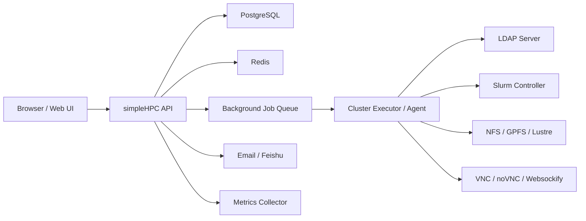
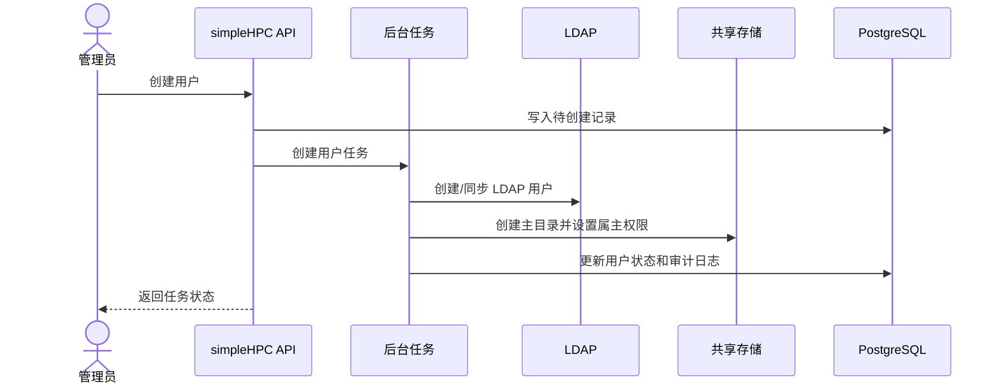
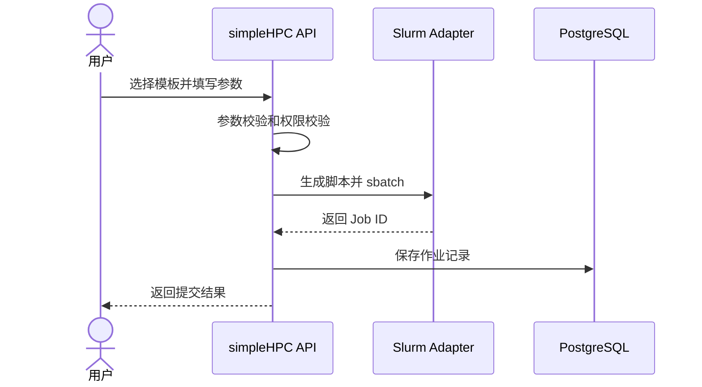
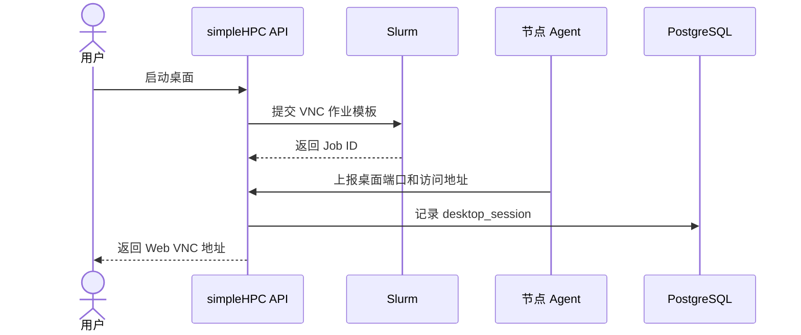

# simpleHPC HPC 集群管理系统项目企划书

版本：v0.1  
日期：2026-06-24  
阶段：项目规划与架构定稿

## 1. 项目背景

高校、科研院所和企业 HPC 集群通常同时存在 LDAP 账号体系、Slurm 调度系统、NFS/GPFS/Lustre 等共享存储、VNC/Jupyter 等交互式作业入口，以及多层级用户组织管理需求。传统运维方式依赖命令行和人工操作，容易出现权限不可追踪、配置变更不可审计、用户入口分散、作业与数据管理体验不统一等问题。

simpleHPC 计划建设一套面向 HPC 集群的 Web 管理平台，将账号、组织、资源、作业、数据、监控、巡检和系统配置整合到统一界面中，形成可审计、可配置、可扩展的集群控制面。

## 2. 项目定位

simpleHPC 不是单纯的监控面板，也不是普通后台管理系统，而是 HPC 集群的“管理控制面 + 用户作业门户 + 运维辅助平台”。

核心定位：

- 面向集群管理员：统一管理 LDAP 用户、Slurm 资源、存储权限、巡检报告和系统配置。
- 面向学院/单位管理员：管理本单位用户、团队、资源使用情况和授权范围。
- 面向团队管理员：管理团队成员、模板授权、团队作业与数据目录。
- 面向普通用户：提交作业、启动交互式桌面、查看作业、管理个人数据。
- 面向运维人员：监控集群状态、查看节点健康、执行巡检、接收告警。

## 3. 参考项目分析

### 3.1 VNC 作业管理项目

参考路径：`root@10.10.38.148:/opt/remote-desktop-platform`

可复用价值：

- Go + Gin + GORM + PostgreSQL 的后端骨架。
- `User / Host / Session / Collaboration / AuditLog` 数据模型思路。
- 宿主机管理、桌面会话管理、文件传输、协作邀请等功能原型。
- Host Agent 通过 WebSocket 连接 Master Service 的控制面思路。
- React + Ant Design 管理后台页面结构。

需要重构或补齐：

- LDAP 登录尚未完整实现。
- 审计日志表存在，但业务操作尚未系统写入审计。
- Host Agent 创建桌面仍是 TODO，当前部分逻辑在 HTTP Handler 中直接 SSH 执行。
- 权限模型仅支持单一 `role`，不满足多角色、多作用域要求。
- 生产安全需要补强：凭据、Host Key 校验、命令注入、默认密钥、配置管理。

### 3.2 Slurm 集群监控项目

参考路径：`/Users/jiaguangqi/claude/slurmclusterinsight_master.v1.3(新增对接pgsql数据库，数据持久化)`

可复用价值：

- Slurm 实时采集逻辑：`sinfo`、`squeue`、`sacct`。
- 队列、作业、节点状态、GPU/CPU 分区统计。
- PostgreSQL 历史数据表：`partition_history`、`job_history`。
- LDAP 登录和普通用户可见范围的原型。
- Dashboard、作业队列、节点热力图、历史趋势页面。

需要重构或补齐：

- 权限模型较简单，只有管理员/普通用户和菜单/队列白名单。
- 后端直接执行命令，缺少统一任务队列、审计和失败回滚。
- 系统设置和凭据管理偏原型，不适合直接生产使用。
- Slurm 配置变更、QOS 策略管理、资源生效流程尚未形成闭环。

## 4. 项目目标

### 4.1 业务目标

- 建立统一 HPC 集群管理入口，减少命令行人工操作。
- 实现账号、组织、团队、角色、资源和作业的统一权限控制。
- 将 Slurm 作业提交、监控、交互式桌面、文件管理统一到 Web 工作流。
- 为管理员提供可审计的资源配置、巡检和告警能力。
- 为后续多集群、多存储、多调度器扩展保留架构空间。

### 4.2 技术目标

- 采用模块化单体架构启动，避免早期过度拆分微服务。
- 后端提供清晰模块边界，后续可拆分为独立服务。
- 高风险操作全部走后台任务队列，并写入审计日志。
- LDAP、Slurm、存储、VNC 桌面等外部系统通过 Adapter/Agent 层接入。
- 敏感配置加密存储，支持连接测试、配置版本记录和回滚。

## 5. 非目标

第一阶段不做以下内容：

- 不实现自动下单或自动资源扩容。
- 不替代 Slurm 本身的调度能力。
- 不把 Web 上传下载作为 PB 级科研数据传输工具。
- 不在 MVP 中支持多调度器，如 PBS、LSF、Kubernetes。
- 不在 MVP 中支持复杂计费结算，只保留数据模型扩展点。

## 6. 用户与权限模型

### 6.1 用户角色

系统支持一个用户绑定多个角色：

- 集群管理员：拥有全局最高管理权限。
- 配置管理员：管理 LDAP、Slurm、存储、邮箱、飞书等系统配置。
- 学院/单位管理员：管理指定单位下的用户、团队和资源视图。
- 团队管理员：管理指定团队成员、模板授权和团队作业。
- 用户：提交作业、查看个人作业、管理个人目录和数据。

### 6.2 权限作用域

权限不能只按角色判断，还要绑定作用域：

- 全局作用域：适用于集群管理员。
- 单位作用域：适用于学院/单位管理员。
- 团队作用域：适用于团队管理员。
- 个人作用域：适用于普通用户。
- 资源作用域：适用于指定 Slurm partition、account、QOS、模板、目录。

推荐采用 RBAC + Scope 模型：

```text
user -> user_role_binding -> role
user_role_binding.scope_type = global | organization | team | resource | self
user_role_binding.scope_id = 对应实体 ID
```

## 7. 功能范围

### 7.1 用户管理

能力范围：

- 对接 LDAP Server。
- 用户增删改查、启用/禁用、同步 LDAP 属性。
- 单位、团队、团队负责人管理。
- 用户基本信息：姓名、账号、邮箱、手机号、单位、团队、UID/GID、主目录。
- 多角色勾选与作用域绑定。
- 用户创建时自动创建主目录或项目目录。
- 用户删除/禁用时支持保留数据、冻结账号、归档目录。

核心风险：

- UID/GID 冲突。
- LDAP 双写失败。
- 用户删除导致数据不可恢复。

### 7.2 资源管理

能力范围：

- 对接 Slurm Controller。
- 查看 partition、node、account、association、QOS。
- 管理用户可用 account/QOS/partition。
- 支持有限范围内的 QOS 策略配置。
- 支持 Slurm 配置草稿、校验、提交、执行、回读。

重要原则：

- `sacctmgr` 类数据库配置可作为即时变更。
- `slurm.conf`、partition、node 配置变更必须走校验和变更流程。
- 所有资源变更必须审计。

### 7.3 数据管理

能力范围：

- 对接 NFS/GPFS/Lustre 等共享存储。
- 新建用户时自动创建目录并设置属主、属组、权限。
- 支持 POSIX ACL 或文件系统原生 ACL 的扩展。
- Web 文件浏览、上传、下载、删除、建目录。
- 支持目录访问权限授权。
- 支持用户、团队、项目目录视图。

边界说明：

- Web 上传下载面向小文件、脚本、结果文件。
- 大规模数据建议接入 SFTP/WebDAV/Globus/对象存储网关等外部能力。

### 7.4 作业管理

能力范围：

- 作业模板管理。
- 模板参数定义、默认资源、参数校验。
- 模板授权到用户、团队、单位。
- 用户基于模板提交 Slurm 作业。
- 作业列表、详情、状态、资源申请、运行节点、工作目录。
- 动态查看作业输出文件内容。
- 作业目录文件上传、下载、删除。
- 支持取消作业、重新提交、复制模板。

交互式作业：

- 将 VNC 桌面作为 Slurm 作业提交。
- 记录 `session_id`、`slurm_job_id`、节点、端口、工作目录、访问地址。
- 关闭桌面时优先 `scancel` 对应作业，并清理残留进程。

### 7.5 监控管理

能力范围：

- 用户数量：在线用户、总用户。
- 活跃用户数量：按最近 N 天登录/提交作业/文件操作统计。
- CPU/GPU 资源利用率。
- 存储资源使用情况。
- 当前作业数量：运行、排队。
- 分队列展示：运行作业数、排队作业数、运行核数、排队核数。
- 节点状态：idle、allocated、mixed、drain、down、maint。
- 历史趋势：资源利用率、作业数量、活跃用户、存储用量。

数据来源：

- Slurm：`sinfo`、`squeue`、`sacct`、`scontrol`、`sacctmgr`。
- 存储：文件系统命令、exporter 或定时采集。
- 系统指标：Prometheus/node exporter 可作为后续增强。
- 平台指标：登录、作业、文件、模板等业务事件。

### 7.6 运维管理

能力范围：

- 配置自动巡检周期。
- 手动一键巡检。
- 巡检项插件化。
- 巡检报告在线查看和下载。
- 失败项分级：info、warning、critical。
- 飞书/邮件告警。

巡检项示例：

- LDAP 连通性。
- Slurm Controller 状态。
- Slurm DBD 状态。
- 节点 down/drain/unknown 状态。
- 共享存储挂载状态。
- 用户主目录权限异常。
- 磁盘空间和 inode 使用率。
- 关键服务状态。
- 最近失败作业和异常排队。

### 7.7 系统设置

能力范围：

- LDAP Server 配置。
- Slurm Server 配置。
- 存储根目录配置。
- 集群管理邮箱配置。
- 飞书机器人 webhook 配置。
- 平台名称、登录页图片、主页面 Logo。
- 配置连接测试。
- 配置变更审计。
- 敏感信息加密存储。

## 8. 推荐技术架构

### 8.1 总体架构



### 8.2 后端技术建议

推荐：

- 语言：Go。
- Web 框架：Gin。
- ORM：GORM。
- 数据库：PostgreSQL。
- 缓存/任务队列：Redis。
- 任务队列：Asynq 或自研轻量任务表。
- 认证：JWT + Refresh Token。
- 配置加密：AES-256-GCM。
- Slurm/LDAP/Storage：Adapter 层封装。

理由：

- 远程 VNC 项目已有 Go/Gin/GORM/PostgreSQL 基础，便于复用。
- Go 适合写 Agent、命令执行器和长连接服务。
- PostgreSQL 适合组织、权限、审计、作业模板等强关系数据。
- Redis 适合会话缓存、任务队列、实时状态缓存。

### 8.3 前端技术建议

推荐：

- React + TypeScript + Vite。
- UI 组件：Ant Design。
- 状态管理：Zustand 或 TanStack Query。
- 图表：ECharts 或 Recharts。
- 终端/日志 tail：xterm.js 或 WebSocket/SSE 文本流。
- 文件上传：分片上传作为后续增强。

理由：

- VNC 项目已有 React + Ant Design 后台形态。
- HPC 管理系统更偏操作后台，Ant Design 的表格、表单、弹窗、权限菜单更合适。
- Slurm 监控项目中的可视化逻辑可以迁移为独立组件。

## 9. 模块划分

后端建议模块：

```text
backend/
  cmd/server/
  internal/auth/
  internal/rbac/
  internal/users/
  internal/orgs/
  internal/ldap/
  internal/slurm/
  internal/storage/
  internal/jobs/
  internal/templates/
  internal/desktops/
  internal/monitoring/
  internal/inspection/
  internal/settings/
  internal/audit/
  internal/notify/
  internal/tasks/
  internal/agent/
```

前端建议模块：

```text
frontend/src/
  api/
  app/
  layouts/
  pages/
    dashboard/
    users/
    organizations/
    teams/
    resources/
    jobs/
    templates/
    data/
    monitoring/
    inspections/
    settings/
  components/
  stores/
  routes/
  types/
```

## 10. 数据库模型初稿

核心表：

- `users`
- `organizations`
- `teams`
- `team_members`
- `roles`
- `permissions`
- `user_role_bindings`
- `ldap_accounts`
- `slurm_accounts`
- `slurm_partitions`
- `slurm_qos`
- `slurm_associations`
- `job_templates`
- `job_template_permissions`
- `jobs`
- `desktop_sessions`
- `storage_roots`
- `storage_directories`
- `file_operations`
- `cluster_nodes`
- `partition_history`
- `job_history`
- `inspection_runs`
- `inspection_items`
- `system_settings`
- `secret_settings`
- `audit_logs`
- `task_runs`

关键原则：

- 所有高风险操作必须有 `task_runs` 和 `audit_logs`。
- Slurm 实时数据可以缓存，但平台内业务状态必须落 PostgreSQL。
- 敏感配置不进入普通 `system_settings`，单独放入加密字段。
- 作业和桌面会话必须保留 Slurm Job ID 关联。

## 11. 核心业务流程

### 11.1 新建用户



### 11.2 提交普通作业



### 11.3 启动 VNC 桌面作业



## 12. 分期计划

### Phase 0：项目初始化

目标：

- 初始化 monorepo。
- 搭建后端、前端、数据库、Docker Compose。
- 建立基础代码规范。

交付物：

- `backend` 服务可启动。
- `frontend` 可访问。
- PostgreSQL/Redis 可通过 compose 启动。
- 健康检查接口。

### Phase 1：认证、组织和权限

目标：

- 用户、单位、团队、角色、作用域权限。
- JWT 登录。
- LDAP 配置与登录。
- 审计日志基础能力。

验收：

- 管理员可创建单位、团队、用户。
- 用户可绑定多个角色和作用域。
- LDAP 连接测试可用。
- 登录和权限拦截可用。

### Phase 2：Slurm 监控与作业列表

目标：

- 接入 `sinfo`、`squeue`、`sacct`。
- 展示队列、节点、作业、资源利用率。
- PostgreSQL 持久化历史数据。

验收：

- Dashboard 展示运行/排队作业、CPU/GPU 利用率。
- 分队列展示运行核数、排队核数。
- 普通用户只能看自己的作业。

### Phase 3：作业模板与提交

目标：

- 作业模板 CRUD。
- 模板授权。
- 参数化提交 Slurm 作业。
- 作业详情和输出文件 tail。

验收：

- 用户可基于授权模板提交作业。
- 管理员可查看所有作业。
- 用户可查看自己的作业输出。

### Phase 4：VNC 桌面作业

目标：

- 将 VNC 桌面纳入 Slurm 作业模型。
- 提供桌面启动、连接、关闭。
- 支持桌面工作目录文件管理。

验收：

- 用户可从 Web 启动桌面。
- 桌面会话关联 Slurm Job ID。
- 关闭桌面能清理 Slurm 作业和会话记录。

### Phase 5：数据管理

目标：

- 用户/团队目录管理。
- 文件上传、下载、删除、建目录。
- ACL/属主/属组管理。

验收：

- 新建用户自动创建目录。
- 用户只能访问授权目录。
- 文件操作有审计记录。

### Phase 6：巡检、告警和系统设置

目标：

- 自动巡检和手动巡检。
- 报告下载。
- 飞书/邮件告警。
- 平台名称、Logo、登录页图片等配置。

验收：

- 管理员可配置巡检周期。
- 巡检报告可下载。
- 关键异常可发送飞书或邮件。

## 13. 验收标准

MVP 验收标准：

- 支持 LDAP 登录和本地管理员登录。
- 支持用户、单位、团队、多角色管理。
- 支持 Slurm 队列、节点、作业监控。
- 支持作业模板提交。
- 支持用户查看自己的作业和输出。
- 支持管理员查看全局监控和作业。
- 支持审计日志查询。
- 支持基础系统配置和连接测试。

生产化验收标准：

- 所有高危操作都有审计记录。
- 敏感配置加密存储。
- Slurm 配置变更有草稿、校验、提交、回读流程。
- 文件路径访问防穿越、防越权。
- 后台任务有状态、日志、失败原因和重试策略。
- 支持备份与恢复文档。
- 关键接口有单元测试和集成测试。

## 14. 主要风险与应对

| 风险 | 影响 | 应对 |
| --- | --- | --- |
| LDAP 写入失败 | 用户创建不完整 | 后台任务化，状态可重试，可人工修复 |
| Slurm 配置误改 | 影响调度系统 | 配置草稿、校验、差异确认、审计、回滚 |
| Web 文件访问越权 | 数据泄露 | 路径规范化、ACL 校验、禁止软链接逃逸 |
| VNC 绕过 Slurm | 资源不可控 | VNC 桌面作为 Slurm 作业提交 |
| 命令注入 | 系统安全事故 | 参数白名单、避免 shell 拼接、封装执行器 |
| 审计缺失 | 无法追责 | 审计中间件和任务审计强制接入 |
| 大文件上传堵塞服务 | 平台性能下降 | 限流、分片、异步任务、大数据走外部传输 |
| Agent 离线 | 管理动作失败 | 心跳、离线状态、任务重试和人工接管 |

## 15. 初始技术决策

### ADR-001：采用模块化单体启动

决策：

- 第一版采用模块化单体，而不是微服务。

原因：

- 当前团队和需求阶段更需要快速交付和清晰边界。
- 用户、权限、作业、审计之间事务关系强。
- 微服务会提前引入部署、链路追踪、服务治理和一致性成本。

后续演进：

- Agent、监控采集、文件传输、通知服务可在边界稳定后拆分。

### ADR-002：后端采用 Go + Gin + GORM + PostgreSQL

决策：

- 使用 Go 作为后端主要语言。

原因：

- 远程 VNC 参考项目已有 Go 基础。
- Go 适合命令执行、Agent、长连接、后台任务。
- PostgreSQL 适合权限、组织、模板、审计等强关系模型。

### ADR-003：VNC 桌面作为 Slurm 作业管理

决策：

- VNC/交互式桌面不绕过 Slurm，统一作为 Slurm 作业提交。

原因：

- 保持资源调度、QOS、account、作业计数和权限一致。
- 避免用户通过桌面会话占用未被调度器感知的资源。

### ADR-004：所有外部系统操作任务化

决策：

- LDAP、Slurm、存储、VNC 相关写操作均进入后台任务。

原因：

- 外部命令和远程系统容易超时、部分成功或失败。
- 任务化便于记录状态、重试、回滚和审计。

## 16. 下一步实施建议

建议下一步从 Phase 0 开始，先搭建项目骨架：

```text
simpleHPC/
  backend/
  frontend/
  deploy/
  docs/
  docker-compose.yml
  README.md
```

第一批代码交付目标：

- 后端 Go 服务。
- 前端 React + Ant Design。
- PostgreSQL + Redis compose。
- `/health` 接口。
- 登录页和主布局。
- 数据库迁移基础结构。
- 用户、角色、审计表的初始模型。

