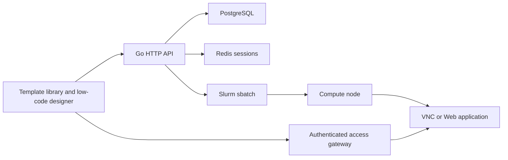

# Job Template System Design

## Requirements

- Administrators and configuration administrators can create, edit, publish, unpublish, import, export, and delete templates.
- A template contains a low-code form schema and an administrator-owned Slurm script.
- Supported runtime kinds are batch, noVNC desktop, and proxied web applications.
- Published templates are visible to users. Draft templates are visible only to administrators.
- Grants can target all users, one user, or one team. Users without a grant may request access.
- Every submission is persisted and traceable to its template version and submitted values.
- User-provided values must never become unescaped shell syntax.

## Architecture

The existing Go monolith remains the control plane. PostgreSQL is the source of truth for templates, grants, requests, and runs. Slurm remains the source of truth for workload state. Interactive endpoints are registered by a running job using a one-time run token and exposed through a server-side gateway.

## Data Model

- `job_templates`: metadata, runtime kind, state, form schema, script, runtime configuration, version.
- `job_template_grants`: `all`, `user`, or `team` target.
- `job_template_access_requests`: pending/approved/rejected workflow.
- `job_template_runs`: immutable submission snapshot, Slurm job id, endpoint metadata and access token.

## Template Contract

The form schema is JSON. Each component has `id`, `type`, `label`, `variable`, validation, default value, and options. Reserved resource variables are `JOB_NAME`, `PARTITION`, `ACCOUNT`, `NODES`, `CPUS_PER_TASK`, `GPUS`, `WALLTIME`, and `WORKDIR`.

The backend generates all `#SBATCH` directives. Form values are emitted as shell environment assignments with POSIX-safe quoting. The administrator script is appended after the generated header and references variables such as `$INPUT_FILE`.

### Dual-workspace editor

Template editing is split into two synchronized workspaces:

- **Frontend UI design** provides a draggable component library, form canvas, and component property inspector. Input components define validated environment variables; section headings, hints, and dividers are presentation-only and do not produce shell variables.
- **Slurm script design** provides a Vim-style shell editor with line numbers, cursor position, Tab indentation, and an insertable list of component and runtime variables. Both workspaces are saved atomically as the template form schema and script template.

## Runtime Kinds

### Batch

The generated script is submitted with `sbatch`. No endpoint is created.

### noVNC

The job allocates a compute node, launches TigerVNC or TurboVNC and a WebSocket bridge, then registers node, port, and protocol with the control plane. Desktop environment and VNC implementation are administrator-owned runtime settings.

### Web application

The job launches Jupyter, code-server, or another administrator-owned command on a selected port and registers the endpoint. The browser accesses it through a token-scoped reverse proxy.

## Authorization

- Management: `cluster_admin` and `config_admin`.
- Published template listing: authenticated users.
- Submission: management role or matching grant.
- Access requests: authenticated users; approval is management-only.
- Endpoint access: run owner or management role.
- Draft templates never appear in normal user listing.

## Failure Modes

- Slurm unavailable: run stays `submit_failed` with a sanitized error.
- Interactive app never registers: run stays `starting`; UI reports readiness timeout.
- Compute endpoint disappears: gateway returns `502` and run health is marked unavailable.
- Invalid schema or variable: publish and submit are rejected.
- Missing runtime binary: preflight rejects submission with the missing dependency.

## Decisions

### ADR-001: Keep the existing monolith

This avoids a second deployment unit and matches the current operational scale. A separate gateway service can be extracted later if concurrent interactive sessions justify it.

### ADR-002: Server-generated resource directives

Users may adjust values within schema limits, but cannot provide raw `#SBATCH` text. This prevents command and scheduler-option injection.

### ADR-003: Database-backed templates only

Starter templates are seeded into PostgreSQL. The frontend contains no template cards or submission data constants.
